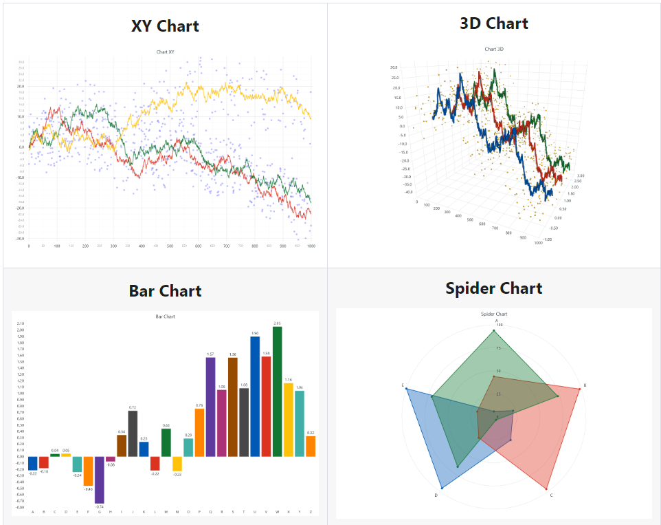

## Predictive Analysis on Stock Prices using Machine Learning and LightningChart Python

### 1. Introduction

#### 1.1 What is the stock market and how does it operate?
The stock market is a complex network of buyers and sellers trading shares, operating as one of the most pivotal components of a free-market economy. It functions on fluctuating prices of shares based on supply and demand dynamics, investor sentiment, and various economic indicators.

#### 1.2 Why is it important for stock traders to attempt stock price prediction analyses?
For stock traders, predicting price movements can mean the difference between significant gains and losses. This highlights the crucial role of stock price prediction using machine learning in Python.

#### 1.3 How can machine learning help in stock prices prediction?
Machine learning, capable of analyzing vast datasets and identifying patterns, has emerged as a powerful tool for stock price prediction. This project explores various models and methodologies used to forecast market trends.

#### 1.4 LSTM Model for Predicting Stock Prices
The Long Short-Term Memory (LSTM) network, a type of recurrent neural network (RNN), is well-suited for sequence prediction problems like stock price forecasting due to its ability to capture temporal dependencies.

### 2. LightningChart Python

#### 2.1 Overview of LightningChart Python
LightningChart Python is a high-performance data visualization library designed for creating complex, interactive, and real-time charts, particularly useful in financial applications.

#### 2.2 Features and Chart Types to be Used in the Project
- **XY Chart**: For visualizing data in two dimensions with series types such as Line Series, Point Line Series, and Area Series.
- **3D Chart**: For a more immersive and detailed view of data trends.
- **Line Chart**: Used for visualizing changes in stock prices over time.
- **Stacked Bar Chart and Grouped Bar Chart**: For comparing different components of stock data.



#### 2.3 Performance Characteristics
Key performance characteristics include real-time data updating, high refresh rates, and efficient data handling, essential for financial applications where data needs to be processed and visualized in real-time.

### 3. Setting Up Python Environment

#### 3.1 Installing Python and Necessary Libraries
Install Python from the [official website](https://www.python.org/downloads/) and use pip to install necessary libraries including LightningChart Python from PyPI. To get the [documentation](https://lightningchart.com/python-charts/docs/) and the [license](https://lightningchart.com/python-charts/), please visit [LighteningChart Website](https://lightningchart.com/).

```pip install lightningcharts random numpy pandas scikit-learn tensorflow```

#### 3.2 Overview of Libraries Used
- **LightningChart**: Advanced data visualization.
- **NumPy**: Numerical computation.
- **Pandas**: Data manipulation and analysis.
- **Scikit-learn**: Data mining and data analysis.
- **Tensorflow**: Machine learning model development.

#### 3.3 Setting Up the Development Environment
Recommended IDEs include Jupyter Notebook, PyCharm, or Visual Studio Code.

### 4. Loading and Processing Data

#### 4.1 How to Load the Data Files
Data can be sourced from financial databases like Yahoo Finance, Alpha Vantage, and Quandl.

```python
import pandas as pd

# Load the dataset
df_googl = pd.read_csv('./CsvPackage/Alphabet Inc - Class A (GOOGL).csv')
df_googl.rename(columns={"Date":"date","Open":"open","High":"high","Low":"low","Close":"close"}, inplace=True)
df_googl['date'] = pd.to_datetime(df_googl.date)
df_googl.sort_values(by='date', inplace=True)
```


#### 4.2 Handling and preprocessing the data
Preprocessing involves cleaning the data, handling missing values, and transforming it for machine learning models.

from sklearn.preprocessing import MinMaxScaler

specified_start_date = pd.to_datetime('2020-01-01')
specified_end_date = pd.to_datetime('2024-05-14')
filtered_df = df_googl[(df_googl['date'] >= specified_start_date) & (df_googl['date'] <= specified_end_date)]

# Normalize/scale the close values between 0 and 1
close_stock_values = filtered_df['close'].values.reshape(-1, 1)
scaler = MinMaxScaler(feature_range=(0, 1))
normalized_close_values = scaler.fit_transform(close_stock_values)

#### 4.3 Validation of the Study
- **Training Data Metrics**: Include R² Score, RMSE, MSE, and MAE to showcase model accuracy.
- **Testing Data Metrics**: Evaluate model generalizability and accuracy.

### 5. Visualizing Data with LightningChart

#### 5.1 Introduction to LightningChart for Python
A tool for creating highly interactive and customizable charts, suitable for financial data visualization.


#### 5.2 Creating the charts
Create various charts using LightningChart Python to visualize stock data effectively.

```import lightningchart as lc```
```import random```
```from datetime import datetime```

```# Initialize LightningChart and set the license key```
```lc.set_license('my-license-key')```

```chart = lc.ChartXY(title='Actual vs Predicted Close Prices')```

#### 5.3 Customizing visualizations
LightningChart offers extensive customization options, including adjusting colors, adding markers, or integrating real-time data updates.

```# Dispose the default x-axis and create a high precision datetime axis```
```chart.get_default_x_axis().dispose()```
```axis_x = chart.add_x_axis(axis_type='linear-highPrecision')```
```axis_x.set_tick_strategy('DateTime')```

```# Convert datetime to timestamps for plotting```
```actual_dates = filtered_df['date'].tolist()```
```actual_close = filtered_df['close'].tolist()```
```actual_date_timestamps = [x.timestamp() * 1000 for x in actual_dates]```

```# Plot actual prices```
```series_actual = chart.add_line_series()```
```series_actual.add(x=actual_date_timestamps, y=actual_close)```
```series_actual.set_name('Actual Prices')```

```# Customize the chart```
```chart.get_default_x_axis().set_title('Date')```
```chart.get_default_y_axis().set_title('Stock Price')```
```chart.add_legend()```
```chart.open()```

### 6. Conclusion

#### 6.1 Recap of creating the application and its usefulness
This application demonstrates using advanced machine learning techniques and high-performance visualization tools to predict future stock prices, providing insightful and actionable information for stock traders.

#### 6.2 Benefits of using LightningChart Python for visualizing data
The library's performance and feature set make it an excellent choice for visualizing stock market data, ensuring traders have access to real-time data for timely and informed decisions.
